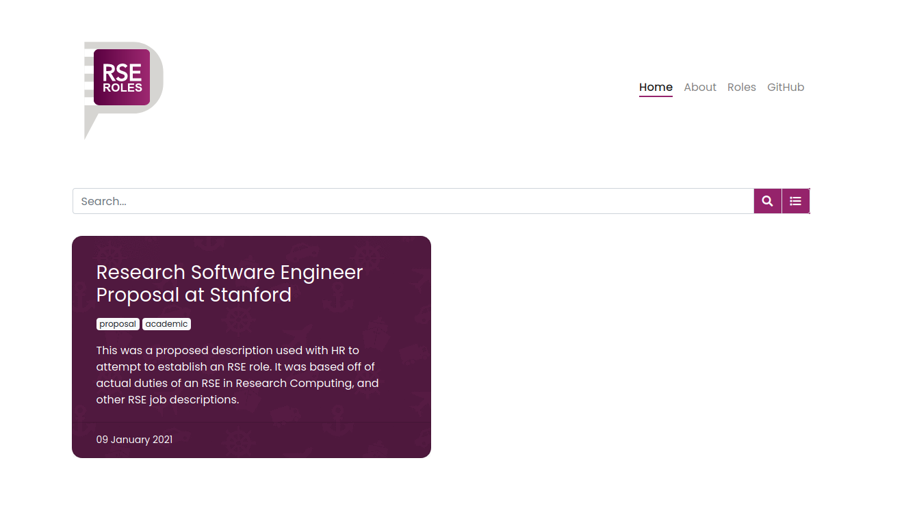

# RSE Roles

    <i>What is the definition of an RSE? I can't tell you, but I can show you.</i>  

## What is RSE Roles?

It's a hard task to define a research software engineer, as the role can emcompass a wide
set of skill sets and tasks. Since we don't have a good way to derive a single definition that everyone
can agree on, by collecting example job descriptions for what an RSE does, we
can start to understand the what skills and responsibilities are commonly associated
with being an RSE. In the future you could imagine doing a small similarity analysis
to compare descriptions, or an assessment of which skills are most saught for, and which
are more rare. For now, it's just a collection of descriptions, and you can
continue reading to learn how to add your description.

## How do I add a job description?

The job descriptions are rendered out of [_posts](_posts), and having them as posts
is done intentionally so there is a date associated with the description. Adding
a job description comes down to creating a new file in this folder, and writing up
the description. Sections that are recommended (but not required) include:

 - Job Description: an overview of the job
 - Responsibilities: a list of the main responsibilities assocated with the role
 - Essential Qualifications: what you think are absolutely necessary.
 - Preferred Qualifications: "Would be nice, but not essential."
 - Education: the minimum education that you think is required

It's important to remember that the language that we use can be biased to select
for different groups, or even the choices we make in the description. You should
make sure that your description does not have [gender](https://www.paycor.com/resource-center/gender-discrimination-in-job-descriptions) 
or other kinds of bias. Once you've written your post, you can submit a pull
request to this repository to have it reviewed, approvied, and merged.

## What would we like to do in the future?

The following would be great!

 - Adding resources to ensure non-biased posts
 - Analysis to compare similarity of different parts of posts (and entire)
 - Analysis to extract common (and uncommon) features of descriptions

If you have any questions or would like to contribute, either via a job description
or work on the site, please [open an issue](https://github.com/USRSE/rse-roles/issues)!
